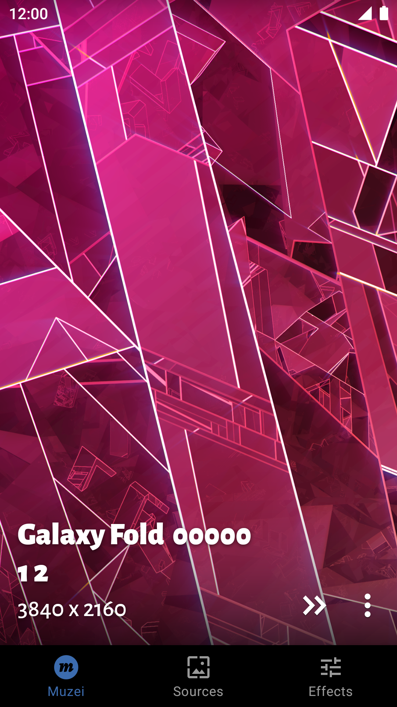
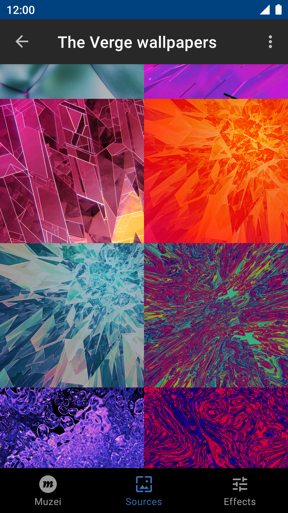
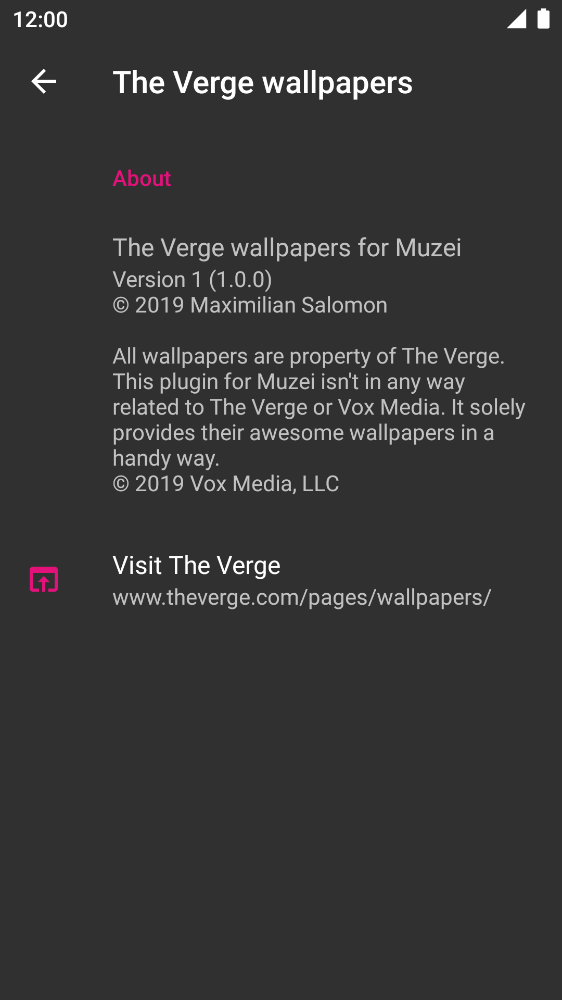

# The Verge wallpapers for Muzei

## About

**All the awesome [wallpapers of The Verge](https://www.theverge.com/pages/wallpapers/) for [Muzei](http://get.muzei.co/).**  
This is a plugin for the live wallpaper app _Muzei_ by Roman Nurik. It needs _Muzei_ to be used.

## Screenshots

   
   
   

## License

**Copyright 2019 MSal**

This program is free software: you can redistribute it and/or modify it under the terms of the GNU General Public License as published by the Free Software Foundation, either version 3 of the License, or (at your option) any later version.  
This program is distributed in the hope that it will be useful, but WITHOUT ANY WARRANTY;
without even the implied warranty of MERCHANTABILITY or FITNESS FOR A PARTICULAR PURPOSE.
See the GNU General Public License for more details.  
You should have received a copy of the GNU General Public License along with this program. If not, see [http://www.gnu.org/licenses/](http://www.gnu.org/licenses/).
